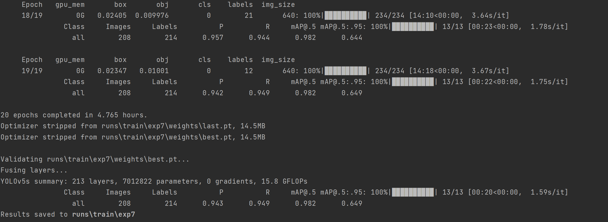
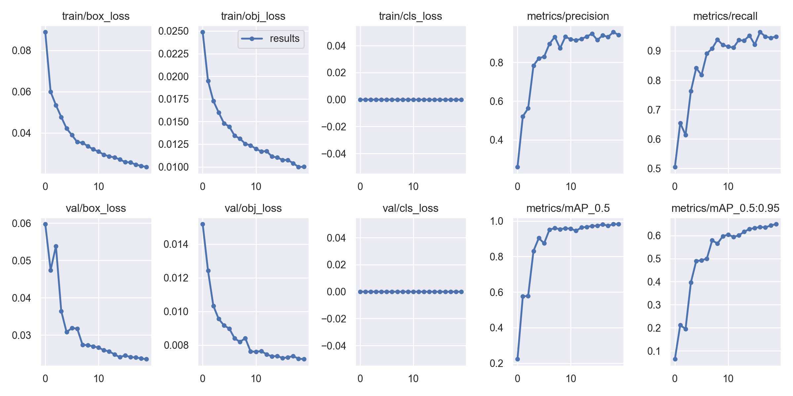
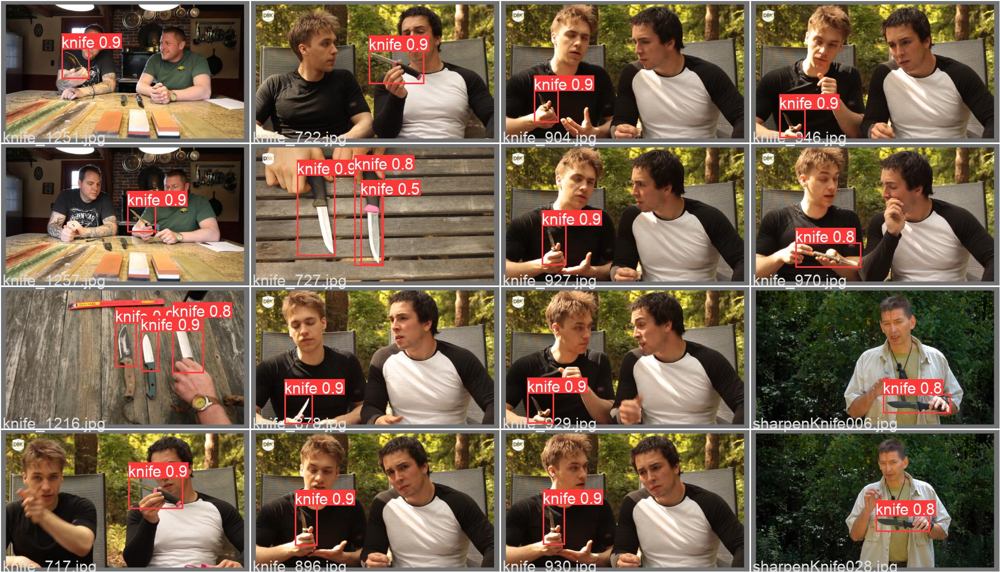

# yolov5_knife_detection

yolov5(https://github.com/ultralytics/yolov5)

dataset(https://github.com/ari-dasci/OD-WeaponDetection)

Thank you

## result







## How To Use

```python
pip install -r requirements.txt
python detect.py --weight runs/train/exp7/weights/best.pt --source 0
```

# Train you own model

you can see this blog

 [(31条消息) Yolov5训练自己的数据集（详细完整版）_缔宇diyu的博客-CSDN博客_yolov5训练自己的数据集](https://blog.csdn.net/qq_45945548/article/details/121701492?spm=1001.2101.3001.6650.1&utm_medium=distribute.pc_relevant.none-task-blog-2~default~CTRLIST~default-1-121701492-blog-109111065.pc_relevant_multi_platform_whitelistv2&depth_1-utm_source=distribute.pc_relevant.none-task-blog-2~default~CTRLIST~default-1-121701492-blog-109111065.pc_relevant_multi_platform_whitelistv2&utm_relevant_index=1) 

if you want import as a interface,you can try by youself

